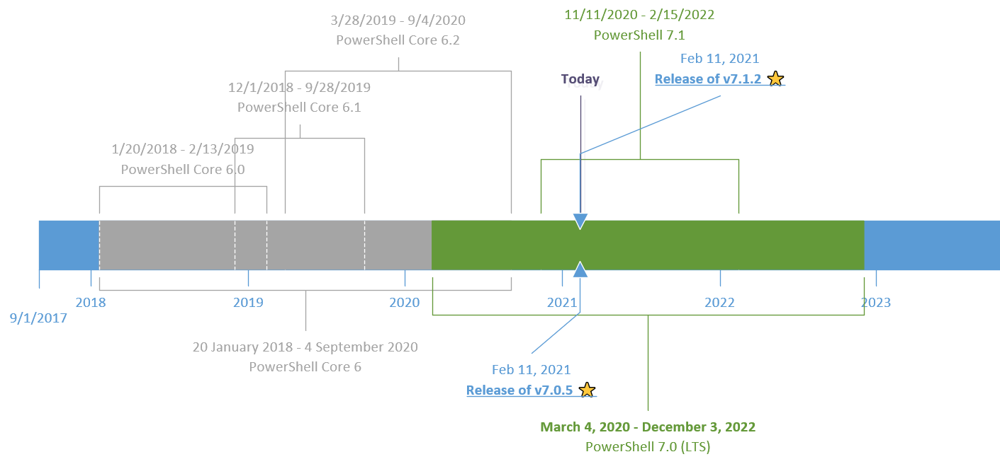

## Welcome to the PowerShell Support Community Pages

This site has been created to aggregate the list of available PowerShell versions and their support information.

### Windows PowerShell vs. PowerShell (Core)

Issues with Windows PowerShell are tracked using [UserVoice](https://windowsserver.uservoice.com/forums/301869-powershell).

Issues related to PowerShell (cross-platform) are tracked on [GitHub](https://github.com/PowerShell/PowerShell/issues).

### Prerequisites of Support

> TL, DR: _You need to use the latest version, you have to have a license for your system, and Microsoft must offer support for the product or service._

Reference: [Modern Lifecycle Policy](https://docs.microsoft.com/en-us/lifecycle/policies/modern)

### Support for different installation options

Microsoft supports the installation methods [published on the docs site](https://docs.microsoft.com/en-us/powershell/scripting/install/installing-powershell). There may be other methods of installation available from other sources. While those tools and methods may work, Microsoft cannot support those methods.

### PowerShell Support Lifecycle

> TL, DR: _The support of PowerShell (Core) is tied to .NET (Core) and there are two types of releases: Long Term Support (LTS) releases, and Current releases._

The official docs are located [here](https://docs.microsoft.com/en-us/powershell/scripting/powershell-support-lifecycle)

### A picture is worth a thousand words

### The latest releases of PowerShell editions required for support

| Edition               | Version |
| :-------------------- | :------ |
| Windows PowerShell    | 5.1     |
| PowerShell (Core) LTS | 7.0.5   |
| PowerShell (Core)     | 7.1.2   |

> Note: We don't use Core in the name starting with V7

### Getting support from the community

If you have questions, you may find help from other members of the community in one of these public forums:

- [User Groups](https://aka.ms/psusergroup)
- [PowerShell Tech Community](https://techcommunity.microsoft.com/t5/PowerShell/ct-p/WindowsPowerShell)
- [DSC Community](https://dsccommunity.org/)
- [PowerShell.org](https://powershell.org/)
- [StackOverFlow](https://stackoverflow.com/questions/tagged/powershell)
- [r/PowerShell subreddit](https://www.reddit.com/r/PowerShell/)
- PowerShell Virtual User Group - join via:
  - [Slack](https://aka.ms/psslack)
  - [Discord](https://aka.ms/psdiscord)

> Last updated on Feb 12, 2021.
