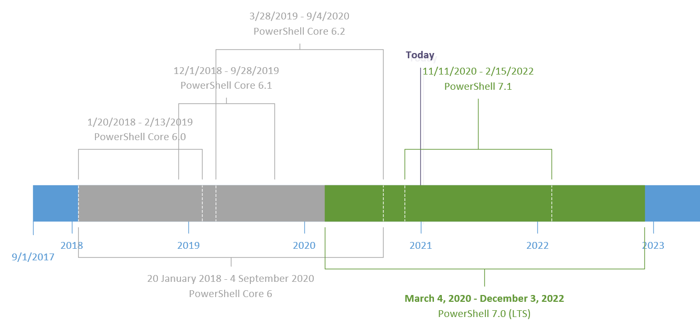

## Welcome to the PowerShell Support Community Pages

This site has been created to aggregate the list of available PowerShell versions and their support information. 

### Windows PowerShell vs. PowerShell (Core)

Issues with Windows PowerShell are tracked using [UserVoice](https://windowsserver.uservoice.com/forums/301869-powershell).

Issues related to PowerShell (cross-platform) are tracked on [GitHub](https://github.com/PowerShell/PowerShell/issues).

### Prerequisites of Support

> TL, DR: _You need to use the latest version, you have to have a license for your system, and Microsoft must offer support for the product or service._

Reference: [Modern Lifecycle Policy](https://docs.microsoft.com/en-us/lifecycle/policies/modern)

### PowerShell Support Lifecycle

> TL, DR: _The support of PowerShell (Core) is tied to .NET (Core) and there are two types of releases: Long Term Support (LTS) releases, and Current releases._

The official docs are located [here](https://docs.microsoft.com/en-us/powershell/scripting/powershell-support-lifecycle)

### A picture is worth a thousand words

